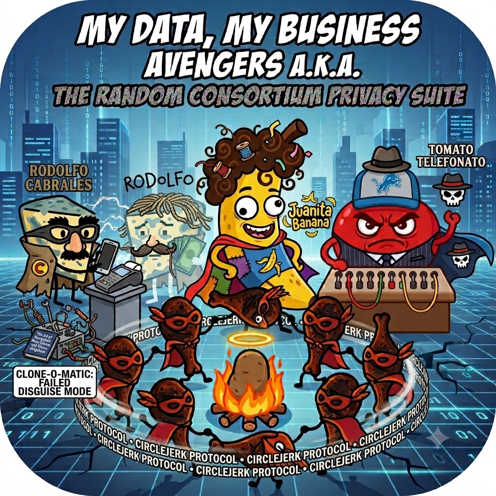

# The Random Consortium 🏴‍☠️
### "My Data, My Business Avengers" — The Privacy Suite that Fights Back

  

---

We are **The Random Consortium**. We build high-quality, spartan, decentralized tools designed to restore individual sovereignty, automate trustless peer-to-peer relationships, and mount active self-defense against the surveillance economy. 

Our philosophy is simple: **My Data, My Business.** If systems seek to fingerprint, track, spam, or analyze us, our tools do not just block them—they actively pollute their datasets, mimic their structures, and loop their connections back onto them.

---

## 🦸‍♂️ The Privacy Suite Avengers

### 🍌 [Juanita Banana](https://github.com/TheRandomConsortium/JuanitaBanana)
*The Spartan Anti-Fingerprinting Browser*
* **What it does:** Fights client-side surveillance by dynamically spoofing canvas fingerprints, audio APIs, system fonts, screen geometries, and User-Agents.
* **Active Defense:** Features an integrated **Ad-Intoxication Engine** that intercepts ad delivery networks and fires automated, background navigation clones to emulate chaotic ad-clicking behaviour, poisoning advertising telemetry databases.
* **Mobile Companion:** Works in tandem with [Juanita Companion](https://github.com/TheRandomConsortium/JuanitaBananaCompanion) via a secure foreground heartbeat service to automate solving reCAPTCHA v3 QR codes using Android Accessibility Services.

### 🌭 [Circle Jerk Protocol](https://github.com/TheRandomConsortium/CircleJerkProtocol)
*The Hot Potato P2P File Sharing Swarm*
* **What it does:** An anonymous, ephemeral, zero-log file sharing protocol running on a DHT swarm.
* **OPSEC by Design:** Operates completely in-memory (volatile RAM shredding upon exit) and runs downloaded files in a bubblewrap (`bwrap`) sandbox.
* **Spam Prevention:** Employs an economic proof-of-work mechanism where publishing files requires encoding hashes in Monero transactions (`tx_extra`), imposing a real-world cost on network spammers.

### 🧀 [Rodolfo Cabrales](https://github.com/TheRandomConsortium/RodolfoCabrales)
*The P2P Collaborative Bread-Buying & Value Interchange Protocol*
* **What it does:** Facilitates trustless peer-to-peer value coordination through a decentralized escrow loop (requiring a third node, C, to hold funds).
* **Dual-Path Exchange:** Supports collaborative physical purchases (card detail sharing) and P2P crypto-fiat interchange (Monero/Bitcoin) with optional, configurable commission support.
* **Active Defense:** When generating transactions, the client auto-populates metadata fields (session IDs, references, memos) by copying and mimicking patterns of public exchange transfers, rendering P2P value movement indistinguishable from routine centralized exchange operations.

### 🍅 [Tomato Telefonato](https://github.com/TheRandomConsortium/TomatoTelefonato)
*The Vengeful Anti-Spam Telephony Protocol*
* **What it does:** An aggressive telephone daemon that intercepts incoming spam and phishing calls.
* **Active Defense:** Rather than silently blocking spammers, it blasts them with high-speed machine-readable legal opt-out notices (GDPR Article 17) to invoke statutory liabilities, traps call centers in decoy reflection loops (playing previous spammers' voices back to them), and shares blacklisted numbers across a P2P gossip network.

---

## 🛑 Supported Platforms (The "Code It Yourself" Clause)

**We build software for sovereign operating systems. We do not support corporate spyware or walled gardens.**

### Desktop Suite (Juanita Banana & Circle Jerk Protocol)
* **Supported:** Linux.
* **Considered:** BSD (Real BSD, not Apple's proprietary bastardization).
* **Rejected:** Windows & macOS.

**Do NOT open issues requesting Windows or Mac ports.** Running a hyper-paranoid, anti-telemetry privacy suite on an operating system that keylogs you by default is a paradox. If you want that shit, fork the repo and code it yourself. And no, BSD being on the table is not an excuse to beg for a Darwin port *"because it's essentially the same"*. It is not.

### Mobile Suite (Tomato Telefonato & Rodolfo Cabrales)
* **Supported:** Android (Sideloaded raw APKs only).
* **Rejected:** iOS / Apple App Store.

**Do NOT request iOS support.** We will never ask a trillion-dollar corporation for permission to run local code on hardware you ostensibly own. 
*Future Notice:* Once Google inevitably enforces hardware-backed anti-sideloading DRM (Play Integrity APIs) to kill open computing, we will drop mainstream Android entirely. The suite will migrate exclusively to sovereign Linux mobile environments (LineageOS, GrapheneOS, Ubuntu Touch).

---

## 📜 Principles

1. **No Central Intermediaries:** Every tool is completely non-custodial and peer-to-peer. We do not run servers, we do not custody coins, and we do not store log files.
2. **Asymmetric Defense:** Defensive measures should impose an economic or operational cost on trackers, spammers, and financial analysts.
3. **Data Sovereignity:** Your browser, your telephone line, and your transactions are your business. Period.
